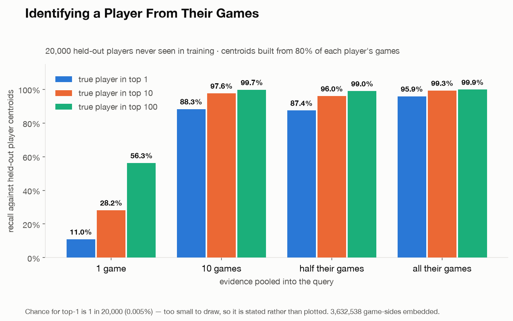
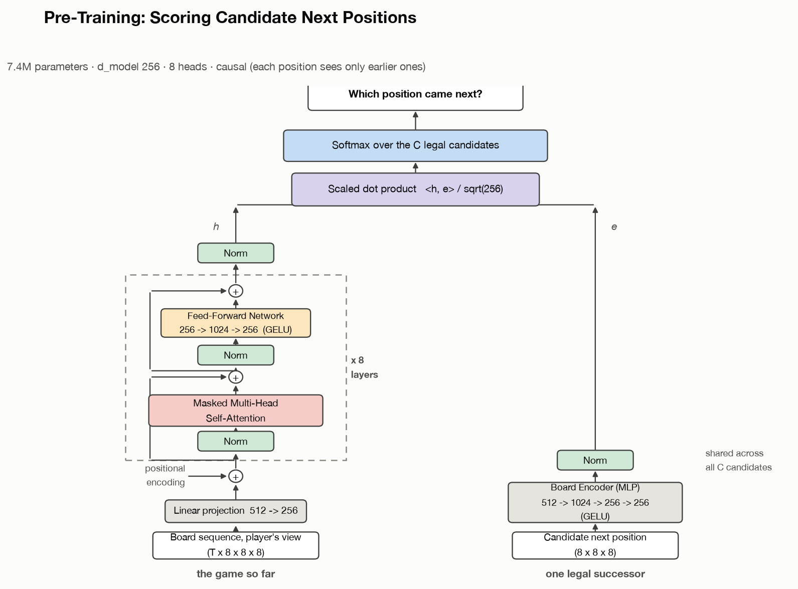
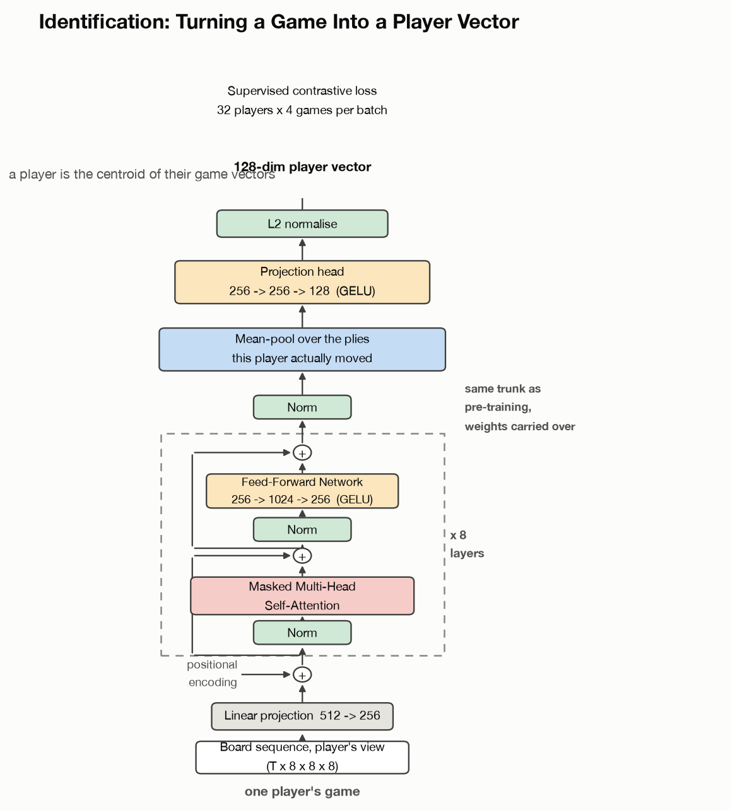

# chess_tracker

**Can you identify a chess player from their games?**

Yes. A single one-minute bullet game identifies its author out of **20,000
held-out players 11.0% of the time** — 2,192x chance. Ten of their games reaches
88.3%; all of them, 95.9%.

<p align="center">
  
</p>

A game becomes a sequence of bitboards, a transformer maps that sequence to a
128-dim vector, a player is the centroid of their game vectors, and an
unattributed game lands near its author.

Everything here was trained on **one RTX 3090 for about $12**.

| | |
|---|---|
| corpus | 134.7M lichess games, 6 months, `60+0` bullet |
| players | 1,286,522 seen · **269,407** with 100+ games |
| model | 7.4M-parameter causal transformer (GPT-2 shaped) |
| pre-training | predict which position comes next |
| identification | supervised contrastive metric learning |

---

## Quickstart

```bash
git clone https://github.com/lthlnkso/chess-tracker
cd chess-tracker
python -m venv .venv && source .venv/bin/activate
pip install -r requirements.txt
```

### Play the model in your browser (CPU, no GPU needed)

```bash
bash scripts/fetch_checkpoints.sh      # ~56 MB from the GitHub Release
python play/server.py                  # open http://localhost:8000
```

It scores every legal successor position and takes the best, showing you its full
probability distribution as it goes. ~7 ms/move on CPU. It plays the Italian Game
out of book and then hangs pieces exactly like the 1500-rated bullet players it
learned from — it has no search and no evaluation function. See
[play/README.md](play/README.md).

### Reproduce the data pipeline (2 minutes, free)

```bash
bash scripts/reproduce_quickstart.sh
```

Streams lichess's first-ever month, decompresses it in flight, and checks the
encoding. You should see **118,734 games / 8,110,498 plies / 4,856 players** and:

```
  POV flip vs board.mirror():        400 random positions OK
  move-code rank mirror:            2000 random codes OK (+ padding sentinel)
  packed moves replay legally:       300 games OK
  POV bitboard tensors:               50 games OK (shape/dtype/turn/parity)
```

The POV transform is verified against python-chess's own `board.mirror()`, so it
is not merely self-consistent.

### Reproduce the headline result

Needs a GPU and a few hours. See [docs/REPRODUCE.md](docs/REPRODUCE.md) for the
full six-month pipeline, and [docs/FINDINGS.md](docs/FINDINGS.md) for the
provenance of every number in this README.

---

## How it works

### 1. Data: don't materialise the bitboards

The obvious approach — write the tensors to disk — does not survive the scale:

| representation | per game | 6 months (135M games) |
|---|---|---|
| uint8 planes, both POVs | ~160 KB | ~21 TB |
| bit-packed planes | ~20 KB | ~2.7 TB |
| **packed moves + metadata (this repo)** | **~169 B** | **21 GB** |

A position is 18 planes x 64 squares and a game averages 68 plies, so materialising
is ~1000x inflation over the move list that generates it. Shards store `uint16`
moves; `bitboards.py` replays them into POV tensors inside the dataloader, which
sustains 437k positions/s across 16 workers — far more than the GPU can consume.

Archives are streamed and decompressed in flight and never land on disk. Filtering
happens on PGN *headers*, before movetext is parsed, which is where ~90% of ingest
cost lives — that is what makes a 30 GB month take 30 minutes.

### 2. Pre-training: score the successor state

<p align="center">
  
</p>

Rather than a softmax over 4096 from-to pairs, the model scores **candidate next
positions**. Candidates come from real move generation, so legality is never
learned, and a dot product means C candidates cost one matmul instead of C
transformer passes.

Against *every* legal successor it picks the move actually played **37.2%** of the
time (uniform-over-legal chance is 5.8%), with the played move at median rank 1.

### 3. Identification: metric learning

<p align="center">
  
</p>

Same trunk, candidate scorer removed, fresh 128-dim projection head. Pooling is
over the player's **own turns** — their choices are the identity signal, not their
opponent's. Trained with supervised contrastive loss over 32 players x 4 games per
batch.

Players are split 80/20; a game-side trains only if its own player is a train
player, and a game is a *test* game only when both seats are test players. Those
invariants are asserted, not assumed.

---

## Things that went wrong (and how they were caught)

Documented in full in [docs/FINDINGS.md](docs/FINDINGS.md). The short version,
because each failure was silent rather than loud:

- **Triplet loss collapsed within 40 steps.** Batch-hard triplet's global minimum
  *is* the constant-output solution, which a network reaches trivially. Verified
  numerically: on a collapsed batch triplet scores 0.6934 (its floor) while SupCon
  scores 4.8442 = exactly `ln(B-1)` (its ceiling). `finetune_id.py` now aborts if
  the pos/neg gap stays flat.
- **A copy-on-write leak.** `.tolist()` on 248M indices creates 248M refcounted
  Python ints; every forked dataloader worker that reads one dirties its page.
  Measured at 0.39 GB/min against a 116 GB ceiling. Numpy indices fixed it.
- **The LR schedule ate a run.** Stretching a cosine over 5 hours parks the LR near
  peak; that run peaked at step 30k then degraded on *both* train and val. Only
  diagnosable because at 2.5% of an epoch, train loss is itself a generalisation
  measure.
- **Castling/en-passant planes made no difference** (0.370 vs 0.368). A causal
  model reading the whole game infers those rights from whether the king or rook
  has moved. The 8-plane encoding is the default because it is simpler.

## Repository layout

```
ingest.py  bitboards.py  verify.py  combine.py  survey.py   data pipeline
model.py   successor_data.py  dataset.py  id_data.py        models & datasets
train_successor.py  eval_successor.py                       pre-training
finetune_id.py      identify_eval.py                        identification
plots/                                                      figures + their source data
play/                                                       browser demo
runpod/                                                     pod orchestration
docs/                                                       reproduction & findings
```

## Licence

MIT — except `play/pieces/`, which is the cburnett set by Colin M.L. Burnett
redistributed under GPLv2+ (see [play/pieces/NOTICE.md](play/pieces/NOTICE.md)).

Game data comes from the [lichess open database](https://database.lichess.org/)
(CC0). This project analyses public game records only, and reports identification
results over held-out accounts in aggregate.
